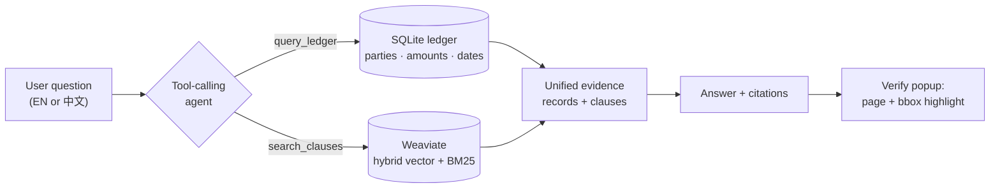
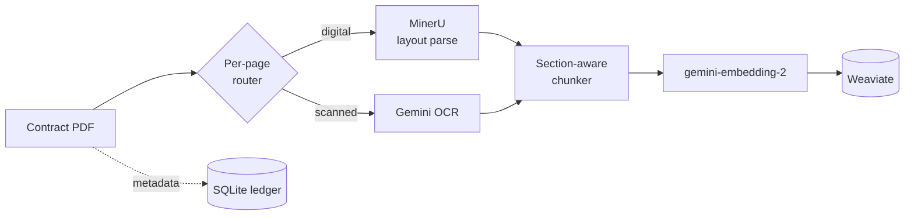

# Contract-RAG

**Agentic RAG for contract intelligence.** A tool-calling LLM agent answers
natural-language questions over a corpus of commercial contracts — deciding *per
query* whether to look up the structured **SQL ledger**, search **clause text** in
a vector store, or both — and returns answers with **clause-level citations
highlighted on the source PDF**. Cross-lingual: ask in Chinese, get answers
grounded in English contracts.

Built on a real ingestion pipeline (layout-aware PDF parsing + OCR routing),
driven by a reproducible evaluation harness, and shipped as a one-command Docker
stack seeded with 100 public contracts.

> ⚠️ Demo data is the public **CUAD** corpus (see [Data & license](#data--license)).
> No proprietary contracts are included.

---

## Highlights

- **Tool-calling agent, not fixed-route RAG.** The LLM owns the SQL-vs-vector
  decision and returns unified evidence — structured `record`s *and* `clause`
  excerpts — in a single answer.
- **Verifiable answers.** Every clause citation carries a `page` + bounding box,
  highlighted on the original PDF for one-click verification.
- **Cross-lingual retrieval.** Chinese questions over English contracts
  (`gemini-embedding-2` hybrid search + an optional managed cross-encoder reranker).
- **Eval-driven decisions.** Agentic-vs-baseline and reranker on/off are backed by
  a regression eval harness over an expert-annotated gold set — including a
  documented *negative* result that killed a feature.
- **Real ingestion.** Per-page routing — digital pages → MinerU layout parse,
  scanned pages → Gemini OCR — then section-aware chunking into dual storage
  (vectors + ledger).

## Architecture

**Query path** — one agent, two tools, unified evidence:



**Ingestion path** — layout-aware, OCR-routed:



## Why agentic? — the eval story

On a **hard, multi-contract question set** (mixing SQL aggregation, clause
retrieval, and cross-contract comparison), the tool-calling agent beats fixed-route
RAG across the board — gains concentrate exactly where fixed routing is weakest:

| Metric (n=8) | Baseline (fixed-route) | Agent (tool-calling) |
|---|---:|---:|
| answer similarity | 0.825 | **0.893** |
| retrieval coverage | 0.296 | **0.771** |
| all-expected-hit | 0.875 | **1.000** |
| source precision | 0.604 | **1.000** |

`evals/run_baseline_vs_agent.py`

### A documented negative result

I integrated a managed reranker (Vertex AI Ranking API) behind a config flag and
A/B-tested it on the 100-contract corpus over **185 expert-annotated clause
questions** (CUAD gold):

| retrieval coverage (n=185) | top-5 (no rerank) | top-5 (reranked) | top-20 ceiling |
|---|---:|---:|---:|
| | 0.802 | 0.806 | 0.808 |

**Δ = +0.0035 (noise).** Hybrid retrieval already lands the right clause in the
top-5 for ~93% of queries, so the reranker has no headroom (only 13/185 cases).
**Decision: kept off** — code retained behind `retrieval.use_reranker` for when the
corpus grows large enough that recall@5 < recall@20. `evals/run_reranker_cuad.py`

## Quickstart (Docker)

Requires Docker and a Google Cloud service account with Vertex AI access (queries
embed + generate live).

```bash
cp .env.docker.example .env.docker      # set VERTEX_PROJECT_ID + the SA path
cp /path/to/service-account.json .secrets/

./run.sh                                # prompts: load the 100-contract demo? [Y/n]
```

- **Y** → seeds Weaviate from the committed snapshot (no re-ingest, no Vertex
  needed to load) and starts ready to query.
- **n** → starts with an empty database; upload your own contracts in the UI.

Then open **http://localhost:3000** (frontend) — API at **:8000**.

## Tech stack

| Layer | Choice |
|---|---|
| Backend | Python 3.12 · FastAPI · LangChain / LangGraph |
| Retrieval | Weaviate (BYO-vector hybrid search) + SQLite ledger |
| Models (Vertex AI) | `gemini-3-flash-preview` (generation) · `gemini-2.5-flash-lite` (routing/judgments) · `gemini-embedding-2` (embeddings) · `semantic-ranker` (reranker, optional) |
| Ingestion | MinerU (layout) · Gemini OCR / Vision · PyMuPDF |
| Frontend | React 18 · Vite · TanStack Query |
| Eval & quality | Custom sync-metric harness · 305 unit tests |
| Infra | Docker Compose (Weaviate + backend + frontend) |

## Repo layout

```
contract_rag/        # backend: api/ ingest/ retrieval/ storage/ sync/
  retrieval/agent.py    # the tool-calling agent (query_ledger / search_clauses)
  ingest/pipeline.py    # PDF → route → parse → chunk → embed → store
  storage/snapshot.py   # portable BYO-vector dump (the docker seed)
frontend/            # React + Vite UI (Q&A, ledger, verify-popup highlight)
evals/               # reproducible eval runners + gold datasets + reports
memory/              # design notes, experiment conclusions, and the "why"s
docs/INTERFACE.md    # the backend↔frontend contract
scripts/             # ingestion + corpus seeding CLIs
```

> `memory/` is worth a read — it's the running log of design decisions and eval
> results (including the dead-ends), kept as the project's institutional memory.

## Data & license

Demo corpus: **CUAD** (Contract Understanding Atticus Dataset) v1 by
[The Atticus Project](https://www.atticusprojectai.org/cuad), licensed
[CC BY 4.0](https://creativecommons.org/licenses/by/4.0/). 100 contracts were
selected and adapted (PDF extraction, derived clause-retrieval gold set) for this
demo. Clause-question ground truth is built from CUAD's expert annotations.
