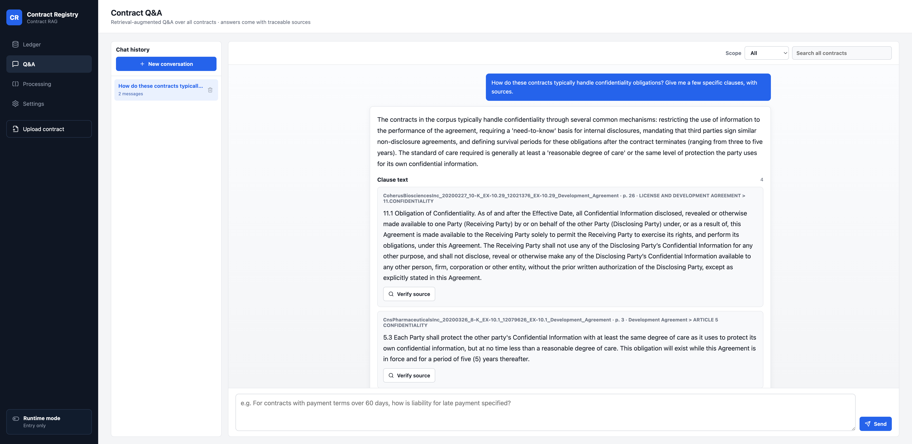
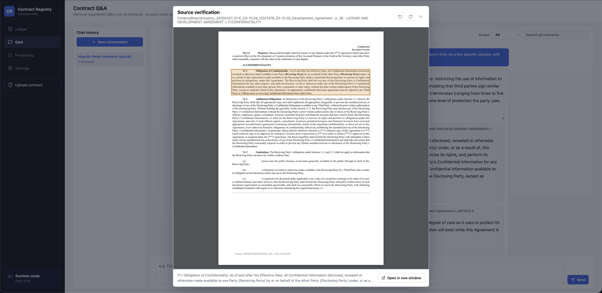
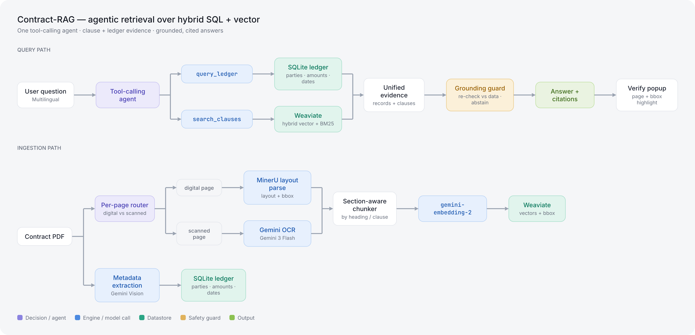

# Contract-RAG

Agentic RAG over a set of business contracts. A tool-calling LLM agent answers each
question by looking up a structured **SQL ledger**, searching **clause text** in a
vector store, or both, and returns the answer with **clause-level citations
highlighted on the source PDF**. A question doesn't need to be in the same language as the
contracts (cross-lingual retrieval, evaluated below). `./run.sh` brings up the full
stack, optionally loading a demo dataset of 100 public sample contracts (CUAD) so you
can query it right away.

---

## What it does

- **Tool-calling agent.** The model chooses SQL lookup, vector search, or both per
  question, and returns the evidence it used alongside the answer.
- **Citations on the source PDF.** Every citation carries a `page` number and a
  highlight box on the source PDF, so an answer can be checked against the document
  in one click.
- **Grounding guard.** A server-side check re-verifies every citation against the
  retrieved data: clause text must be a verbatim match, ledger values are re-read
  from the row. If nothing survives, the agent returns "not enough evidence" instead
  of answering. Retrieved text is also defended against prompt injection. See
  [Safety & observability](#safety--observability).
- **Cross-lingual retrieval.** A question in one language can match clauses written in
  another. Measured on a small hand-labeled set: `recall@1 = 90%`, `recall@3 = 100%`.
- **Eval-driven decisions.** Agent vs. baseline and reranker on/off were each settled
  by tests on a gold set. One of them was a negative result that removed a feature.
- **Observability.** Each question is logged as a single LangSmith trace (tool calls,
  token cost, grounding result). 👍/👎 feedback is stored and can be exported as a
  labeled example.

## Screenshots

Answers come with clause-level evidence. Click any citation to open the source page
with the exact clause highlighted.





## Quickstart (Docker)

Needs Docker and a Google Cloud service account with Vertex AI access (live queries
call the embedding and generation models).

```bash
cp .env.docker.example .env.docker      # set VERTEX_PROJECT_ID + the SA path
cp /path/to/service-account.json .secrets/

./run.sh                                # prompts: load the 100-contract demo? [Y/n]
```

- **Y** loads Weaviate from the saved snapshot (no re-ingest, and no Vertex needed
  just to load) and starts ready to query.
- **n** starts with an empty database; upload your own contracts in the UI.

Then open **http://localhost:3000** (frontend). The API is at **:8000**.

## Running the evals

Each runner's docstring explains what it measures and how to run it:

```bash
uv run python -m evals.run_baseline_vs_agent   # agentic vs fixed-route RAG
uv run python -m evals.run_reranker_cuad        # the reranker A/B (negative result)
uv run python -m evals.run_injection            # prompt-injection leak test
uv run python -m evals.run_multihop             # hard multi-step / aggregation set
```

Reports are written to `evals/reports/` as timestamped JSON (generated files; the
repo keeps only the `.gitkeep` placeholder).

## Configuration

**Secrets** — in `.env` / `.env.docker` (git-ignored; start from `.env.docker.example`):

| Variable | Required | What |
|---|:--:|---|
| `VERTEX_PROJECT_ID` | ✅ | your Google Cloud project ID |
| `GOOGLE_APPLICATION_CREDENTIALS` | ✅ | path to the service-account JSON (live queries need it) |
| `LANGSMITH_*` | — | optional; turns on LangSmith tracing |

**Tunable settings** — in `contract_rag/config.yaml`:

| Key | What | Default |
|---|---|:--:|
| `retrieval.alpha` | keyword ↔ vector weight in hybrid search | `0.5` |
| `retrieval.use_reranker` | turn the managed reranker on/off | off |
| `retrieval.k` / `top_n` | chunks fetched / kept | — |
| `chunking.*` | chunk size & overlap | — |
| `models.*` | model ID per task (generation, routing, embedding) | — |

## Bring your own contracts

Besides uploading in the UI, you can (re)build the corpus from the command line:

```bash
# Batch-ingest a folder of PDFs → MinerU parse → chunk → embed → Weaviate + ledger.
# Resumable, and you can --limit it; a bad PDF is logged and skipped rather than stopping the run.
uv run python -m scripts.ingest_cuad --limit 5   # try a few first
uv run python -m scripts.ingest_cuad             # the whole corpus

# Rebuild the clause-retrieval gold set from CUAD's expert annotations
uv run python -m scripts.build_cuad_gold
```

## Architecture

One agent answers over two stores; ingestion routes each page to the right parser.



- **Query path:** the agent picks `query_ledger` (SQLite), `search_clauses`
  (Weaviate), or both. A grounding guard re-checks every citation before it returns.
- **Ingestion path:** each page is routed by type (digital to MinerU, scanned to
  Gemini OCR), chunked by section, embedded with `gemini-embedding-2`, and stored in
  Weaviate with metadata in the ledger.

## Ingestion: parsers chosen by testing

I picked each parser by comparing the options on real bilingual contracts, checking
the output against the actual page image.

**Scanned pages: Gemini 3 Flash.** Five OCR "risky spots" where a silent error
changes the meaning (amount first digit, `$` vs `5`, thousands separator, column
separation, second-language phrase):

| Risky spot | MinerU (local) | DeepSeek-OCR (local) | Gemini 2.5 Flash | **Gemini 3 Flash** |
|---|:--:|:--:|:--:|:--:|
| Amount first digit (`17.98`) | ❌ `7.98` | ❌ loop | ✅ | ✅ |
| `$` vs `5` | ❌ `$`→`5` | ❌ `$`→`5` | ✅ | ✅ |
| Thousands separator | ❌ `,`→`.` | ❌ | ✅ | ✅ |
| Columns stay separate | ❌ misaligned | ❌ fill-down | ⚠️ suspect | ✅ |
| Key second-language phrase | ✅ | ❌ garbled | ❌ meaning changed | ✅ |

Gemini 3 Flash was the only engine clean on all five ($0.66 / 47 pages; MinerU is
free but ~19 min on CPU). It sits behind a swappable `OCRProvider`.

**Digital pages: MinerU.** Best in every row, and it emits a structured
`content_list.json` with heading levels, header/footer tags, and a `bbox` per element
(reused by the PDF-highlight feature):

| Capability | **MinerU** | unstructured (hi-res) | pdfplumber |
|---|:--:|:--:|:--:|
| Second-language paragraphs | ✅ | ❌ garbled | ✅ |
| Dense price table | ✅ | ❌ ~80% cells dropped | ✅ simple grids |
| Complex-layout table | ✅ | ⚠️ | ❌ columns misaligned |
| Heading levels (H1–H3) | ✅ `text_level` | ⚠️ partial | n/a |
| Header/footer removal | ✅ auto-tagged | ❌ | n/a |
| Position boxes (for highlight) | ✅ | ❌ | metadata only |

## Agent vs. baseline (measured)

The agent's main advantage is evidence quality. It cites the specific contracts it
used, giving ~4× higher source precision and roughly double the coverage and top-1
accuracy on this set (`evals/dataset_sql_gated_agent.jsonl`, n=11, small):

| Metric (n=11) | Fixed-route baseline | Tool-calling agent |
|---|---:|---:|
| Source precision | 0.19 | **0.73** |
| Retrieval coverage | 0.28 | **0.60** |
| Top-1 expected source | 0.36 | **0.73** |
| Answer similarity | 0.84 | 0.80 |
| All expected sources hit | 0.91 | 0.73 |
| Avg. tool rounds | — | 3.3 |

The baseline's high "all-hit" score (0.91) is hollow. It returns all ~100 contracts
every time, which its 0.19 precision exposes; the agent trades that for citations that
can be checked. Its one remaining gap was ranking questions (it once answered "second
largest" with the third). Teaching `query_ledger` to `sort` and `top_n` closed it: a
multi-step eval went from f1 0.73 to 1.0 with fewer tool calls.

**Other measured results:** cross-lingual `recall@1 = 90%`, `recall@3 = 100%`; a RAGAS
baseline (faithfulness 0.86, answer-correctness 0.44); hybrid `alpha` tuned to 0.5;
and a managed reranker that showed no gain on 100 contracts, so it stays off behind a
flag.

## Safety & observability

The answer text and the retrieved data both pass through the model, so neither is
trusted on the model's say-so. Two server-side layers handle this, both with tests
(see `docs/INTERFACE.md` §5):

- **Grounding guard.** A clause citation must be a verbatim substring of a retrieved
  chunk from the same contract. Record values are re-read from the actual ledger row.
  If nothing survives, the agent returns "not enough evidence."
- **Prompt-injection defense.** Retrieved text is wrapped in a fenced data block, with
  a system-prompt rule that treats everything inside it as quotable data rather than
  instructions. Text hidden in a contract stays text.
- **Observability.** Each question is logged as a single LangSmith trace (counts, tool
  calls, token cost, grounding result). 👍/👎 feedback is stored and can be exported to
  the gold set.

## Development (local, without Docker)

Tooling: [uv](https://docs.astral.sh/uv/) (Python 3.12) for the backend, Node 18+
for the frontend.

```bash
# Backend deps (creates .venv from uv.lock)
uv sync

# Run the test suite (unit tests are self-contained — no Vertex/Weaviate needed)
uv run pytest                          # backend (349 tests)
cd frontend && npm install && npm test # frontend (vitest)
```

Running the **full stack** locally (Weaviate + backend + frontend dev servers):

```bash
# 1. Weaviate only (the backend talks to it on :8080 / :50051)
docker compose up weaviate

# 2. Backend API with autoreload (needs .env — see Configuration above)
uv run uvicorn contract_rag.api.app:app --reload --port 8000

# 3. Frontend dev server (proxies to the API)
cd frontend && npm run dev             # http://localhost:5173
```

> Live queries call Vertex AI (embedding + generation), so the backend needs valid
> Vertex credentials even in local development. Most of the tests run offline.

## Tech stack

| Layer | Choice |
|---|---|
| Backend | Python 3.12 · FastAPI · LangChain / LangGraph |
| Retrieval | Weaviate (bring-your-own-vector hybrid search) + SQLite ledger |
| Models (Vertex AI) | `gemini-3-flash-preview` (generation) · `gemini-2.5-flash-lite` (routing/judgments) · `gemini-embedding-2` (embeddings) · `semantic-ranker` (reranker, optional) |
| Ingestion | MinerU (layout) · Gemini OCR / Vision · PyMuPDF |
| Frontend | React 18 · Vite · TanStack Query |
| Observability | LangSmith (per-query traces + user feedback) |
| Infra | Docker Compose (Weaviate + backend + frontend) |

## Repo layout

```
contract_rag/        # backend: api/ ingest/ registry/ retrieval/ storage/
  retrieval/agent.py        # the tool-calling agent (query_ledger / search_clauses)
  retrieval/grounding.py    # grounding guard: verify citations vs real data, else refuse
  retrieval/injection.py    # prompt-injection defense (wrap untrusted tool data)
  ingest/pipeline.py        # PDF → route → parse → chunk → embed → store
frontend/            # React + Vite UI (Q&A, ledger, verify-popup highlight)
evals/               # repeatable eval runners + gold datasets + reports
docs/INTERFACE.md    # the backend↔frontend contract
```

## Data & license

Demo corpus: **CUAD** (Contract Understanding Atticus Dataset) v1 by
[The Atticus Project](https://www.atticusprojectai.org/cuad), licensed
[CC BY 4.0](https://creativecommons.org/licenses/by/4.0/). 100 contracts were adapted
(PDF extraction + a derived clause-retrieval gold set) for this demo; clause-question
answers come from CUAD's expert annotations.
